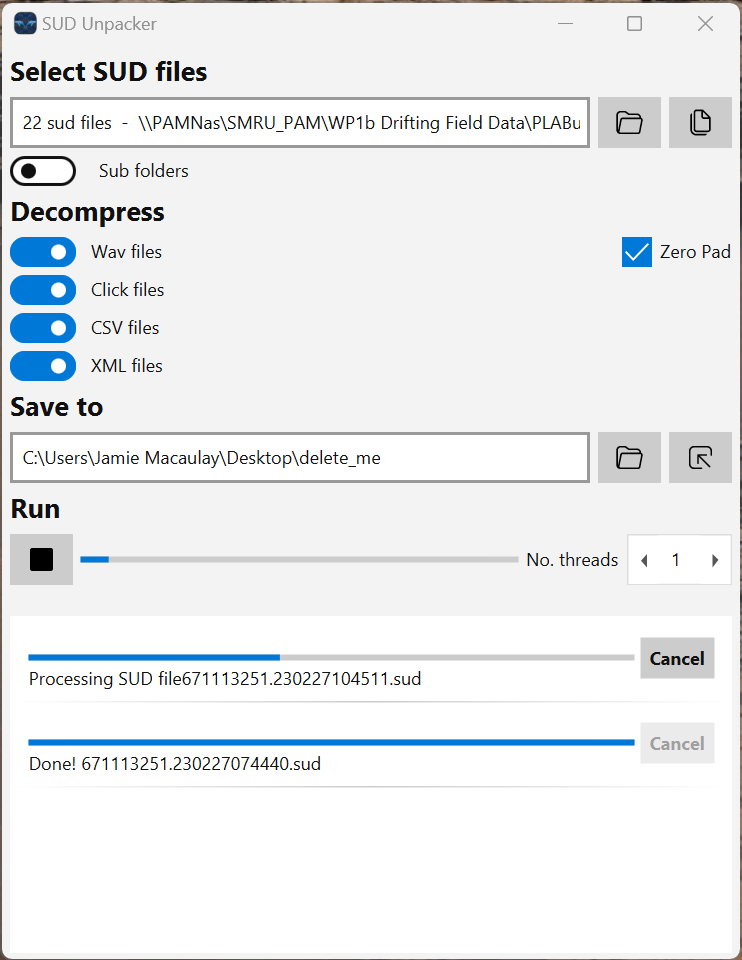

# SUDUnarchiver

## Introduction

SUDUnarchiver is the sud file decompressiong program you always wished you had for your SoundTrap data. Sud decompression is now built directly into [PAMGuard](www.pamguard.org), however, there are use cases when users may wish to, for example, extract only metadata from sud files or need uncompressed wav files for analysis in other programs. SUDUnarchiver is an easy-to-use program with a number of powerful features not available in SoundTrap or PAMGuard. 

- Decompress all sud files within a folders or subfolders. 
- Select which data within sud files to decompress. 
- Multi-threading so powerful processors can decompress data faster.
- Cross platform (Windows, Linux and Mac). 

## Installation 

SUDUnarchiver is available as an .exe file to be used in Windows in the releases/windows folder (Mac OS suppport soon). 

## Use

SUDUnarchiver is straightforward to use. 

- 1 -> Select a folder or multiple files.
- 2 -> Select which data you would like to decompress.
- 3 -> Optionally select a location to save files to. 
- 4 -> Select mult threading if your computer is up to it and press the run button. 

An example of SUDUnarchiver decompressing a folder of files.

## License
This program is open source under a GNU General Public License v3.0. This a viral open soruce license whcih means you can use or modify the code or program in any way you wish, however, if you use this source code, then you need to make whichever code you've used it in is also open. 

