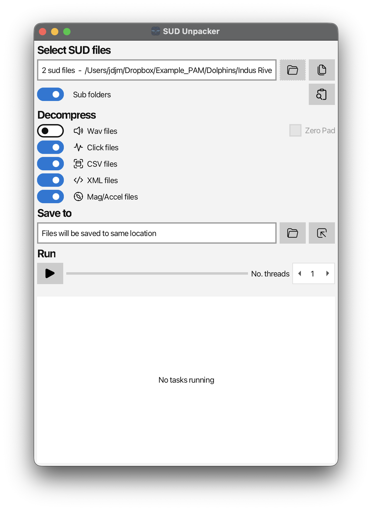
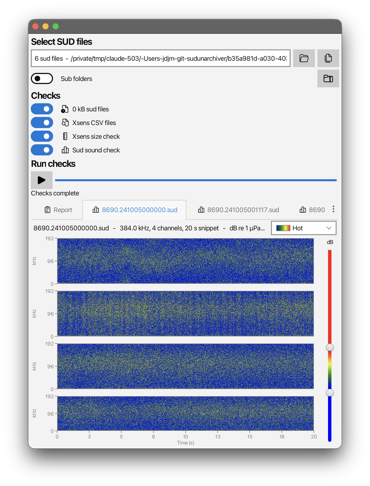

# SUDUnarchiver

## Introduction

SUDUnarchiver is the sud file decompressiong program you always wished you had for your SoundTrap data. Sud decompression is now built directly into [PAMGuard](www.pamguard.org), however, there are use cases when users may wish to, for example, extract only metadata from sud files or need uncompressed wav files for analysis in other programs. SUDUnarchiver is an easy-to-use program with a number of powerful features not available in SoundTrap or PAMGuard. 

- Decompress all sud files within a folders or subfolders. 
- Select which data within sud files to decompress. 
- Check a deployment for common problems before decompressing it. 
- Plot spectrograms of the sound inside sud files to see, at a glance, whether a deployment recorded properly. 
- Multi-threading so powerful processors can decompress data faster.
- Cross platform (Windows, Linux and Mac). 

## Installation 

SUDUnarchiver is available as an .exe file to be used in Windows in the releases/windows folder. This needs Java 21 or above installed. 

Native installers, which bundle their own Java runtime and so need nothing else installed, can be built from source with [jpackage](https://docs.oracle.com/en/java/javase/21/jpackage/). Each installer has to be built on the platform it is for. 

```bash
mvn -Pinstaller-mac clean verify
```

```bash
mvn -Pinstaller-windows clean verify
```

These put a .dmg (macOS) or .msi (Windows) in `sudunarchiver/target/installer`. 

## Use

SUDUnarchiver is straightforward to use. 

- 1 -> Select a folder or multiple files.
- 2 -> Select which data you would like to decompress.
- 3 -> Optionally select a location to save files to. 
- 4 -> Select mult threading if your computer is up to it and press the run button. 

<center></center>
SUDUnarchiver set up to extract the sensor and metadata files from a deployment. Every toggle in the Decompress section is on except Wav files - decompressing the audio is slow and can need terabytes of disk space.

## Checking sud files

Decompressing a whole deployment takes a while, so it is worth knowing whether the deployment is sound before starting. The button to the right of the sub folders switch flips the pane over to a set of checks which run on whichever files are currently selected. The same button flips back to the decompression controls. 

Each check can be switched on and off individually. 

- **0 kB sud files** -> checks that none of the selected sud files are empty. 
- **Xsens CSV files** -> checks that every sud file has a matching \*.xsensIMU.csv file. 
- **Xsens size check** -> checks that those \*.xsensIMU.csv files are a sensible size rather than near empty. 
- **Sud sound check** -> opens a few sud files, spread evenly through the deployment, and reads a snippet of sound from each of them. 

<center></center>
The Checks controls. The clipboard button, top right, flips between these and the decompression controls.

Press play and the results appear in the report tab below, with a summary line saying whether the deployment passed, and the names of any files which caused a check to fail. Checks can be stopped part way through. 

<center></center>
The Report tab. Each check gets a line, and anything which failed is listed with the names of the files which caused it.

The sound check also adds a tab per sud file it opened, each showing a spectrogram of the snippet for every channel in the file. The spectrograms are in dB re 1 uPa<sup>2</sup>/Hz and have the same colour range slider and colour maps as PAMGuard, so the amplitude limits and colours of the plot can be changed to suit the data. This is a quick look to confirm the recorder was listening to something sensible - it is not a display to navigate around. 

<center></center>
A spectrogram tab from the sound check, with one spectrogram per channel of the sud file.

## License
This program is open source under a GNU General Public License v3.0. This is a viral open source license which means you can use or modify the code or program in any way you wish, however, if you use this source code, then you need to make whichever code you've used it in is also open. Using the program to decompress data etc. has no effect on whether the data is open or not.
